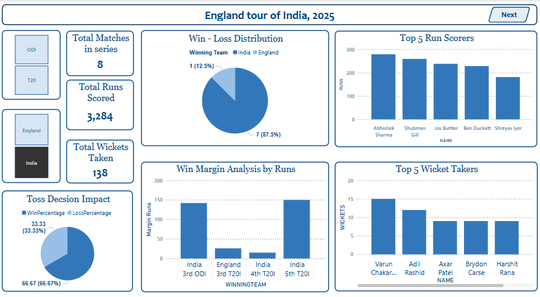

# 🏏 Cricbuzz Cricket Analytics Dashboard

An end-to-end data engineering and visualization project that fetches real-time cricket data from the Cricbuzz API and builds insightful dashboards using Snowflake and Power BI.

---

## 📌 Project Overview

This project captures live and historical cricket data — including player stats, match outcomes, series insights, partnerships, and rankings — to build a robust analytical platform for cricket lovers, analysts, and fantasy players.

---

## 🚀 Tech Stack

- **Data Extraction**: Python + RapidAPI (Cricbuzz API)
- **Data Warehouse**: Snowflake
- **Data Transformation & Cleaning**: Python (pandas), SQL (Snowflake)
- **Dashboard & Visualization**: Microsoft Power BI


---

## 🧱 Project Architecture

```
Cricbuzz API
    ↓
Python ETL Scripts
    ↓
Cleaned & Transformed Data
    ↓
Snowflake Data Warehouse
    ↓
Power BI Dashboards
```

---

## 📂 Data Model

| Table Name                    | Description |
|------------------------------|-------------|
| `icc_rankings_main`          | ICC player & team rankings (Test, ODI, T20) |
| `team_players_main`          | Player roster and details per team |
| `player_batting_stats_main`  | Historical batting performance |
| `player_bowling_stats_main`  | Historical bowling performance |
| `series_main`                | Series-level metadata |
| `matches_main`               | Match details including teams, results |
| `innings_main`               | Inning-wise stats like score, RR, wickets |
| `battingperformance_main`    | Player-wise batting performance per innings |
| `bowlingperformance_main`    | Over-by-over bowling breakdown |
| `partnerships_main`          | Batting partnerships analysis |
| `wickets_main`               | Fall of wickets detail |

---

## 📈 Dashboard Modules

### 1. ICC Rankings
- Top players by format and role
- Filter by country and position

### 2. Team & Player Insights
- Batting and bowling performance
- Player career trends and match impact

### 3. Series & Match Analysis
- Win/loss summaries
- Toss impact vs match results
- Match-wise performance drilldown

### 4. Innings & Micro Stats
- Ball-by-ball impact
- Top partnerships
- Fall of wickets patterns

---

## 🔧 How to Run Locally

### 1. Clone the Repository
```bash
git clone https://github.com/AkshSurani/cricbuzz-cricket-data-pipeline-dashboard.git
cd cricbuzz-dashboard
```

### 2. Install Dependencies
```bash
pip install -r requirements.txt
```

### 3. Configure Environment
Create a `.env` file:
```ini
RAPIDAPI_KEY=your_cricbuzz_api_key
SNOWFLAKE_ACCOUNT=your_account
SNOWFLAKE_USER=your_username
SNOWFLAKE_PASSWORD=your_password
SNOWFLAKE_DATABASE=cricket_db
SNOWFLAKE_SCHEMA=public
SNOWFLAKE_WAREHOUSE=compute_wh
```

### 4. Run the ETL Scripts
```bash
Run python Files.
```

### 5. Load to Snowflake
Configure your Snowflake connection and execute the load script using Python or SQL.

### 6. Open Power BI Dashboard
- Open `Cricbuzz_Cricket_Dashboard.pbix`
- Connect to Snowflake
- Refresh visuals to see the latest data

---

## 🔍 Key KPIs Tracked

### 🏆 Player KPIs
- Top Run Scorers (avg, SR, consistency)
- Top Wicket Takers (econ, avg, impact)
- Player Rankings (format-wise, role-wise)

### 📊 Series KPIs
- Win/Loss records
- Toss decision impact
- Series-wide score summaries

### 🔬 Micro Analytics
- Batting Partnerships
- Powerplay & Death Over performance
- Fall of Wickets Timeline

### 📈 Team KPIs
- Squad composition by roles
- Margin of victory
- Country-wise dominance

---

## 🧠 Advanced Ideas (Future Enhancements)

- ⏰ Real-time Auto Refresh using GitHub Actions or Airflow
- 📱 Fantasy Cricket Insights & Player Selection Advisor
- 🧮 Predictive Analysis using ML models (Win Predictor, Player Form)

---

## 👤 Contributor

**Aksh Surani** – Data Engineer
[LinkedIn](https://linkedin.com/in/akshsurani)

**Divy Kaila** – Data Engineer
[LinkedIn](https://www.linkedin.com/in/divy-kaila-833b27272?utm_source=share&utm_campaign=share_via&utm_content=profile&utm_medium=android_app)

---

## 📄 License

This project is intended for **educational and portfolio use**.  
API access is bound by **Cricbuzz and RapidAPI** terms of service.

---

## 📸 Dashboard Screenshots 

Place your dashboard screenshots in the `screenshots/` folder and embed them here.

### 🧭 Overview Dashboard


### 🏏 Batting Performance Page


### 🎯 Conversion and Centuries Page


### 📊 Matches Analysis Page


### 📈 Player Batting Stats In Series Page


### 📉 Total Runs, Contribution Per Match Page


---

## 🌟 If you like this project...

Give it a ⭐ on GitHub!  
Or share it with your cricket analytics buddies. 🏏
